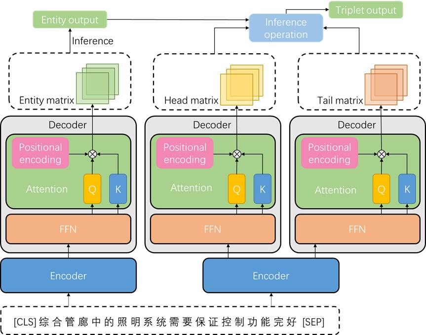
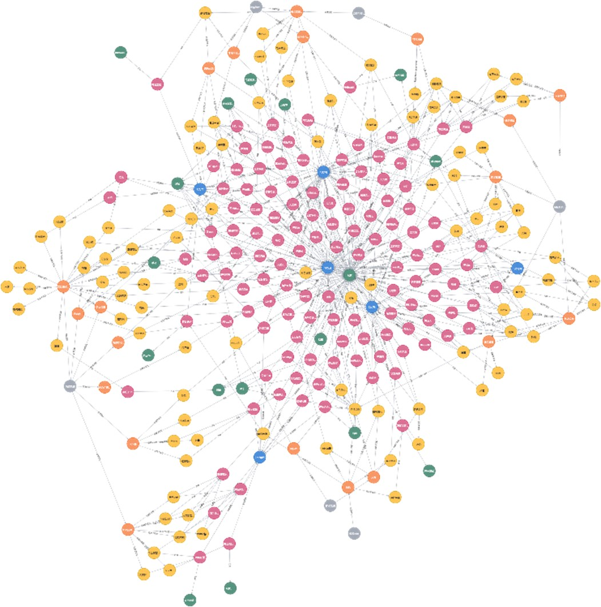

# GPBP
This repo provides the source code & data of our paper "[GPBP: Pipeline Extraction of Entities and Relations for Construction of Urban Utility Tunnel Knowledge Graph](https://ieeexplore.ieee.org/document/10295733)" (SAFEPROCESS 2023).

## Overview

the main contributions of this paper are as follows: 

• We construct, clean, and annotate corpus datasets from maintenance manuals and official documents of urban utility tunnel, which contains 800 sentences and nearly 30000 characters. We name the datasets Standards for Operation and Maintenance of Urban Utility Tunnel (SOMUUT). 

• According to the specific application environment of utility tunnel, we proposed a Global Pointer Based Pipeline approach (GPBP) for entity and relation extraction, which has a better performance on SOMUUT than mainstream models like GPLinker

<p float="left">
  
  
</p>

The resulting file structure should look like this:

```bash
.
├── README.md
├── img/
├── construction/
    ├── construction-manual.py
    ├── construction-text.py
    
└── data/
    ├── manual/                 (maintenance manuals)
    └── text/
        ├── convert.py          (convert source data to dataset SOMUUT)
        ├── source_data.json    (source label data)
        ├── somuut.json         (the datasets SOMUUT)
        └── ...
```

## Urban Utility Tunnel Knowledge Graph

Start service of Neo4j

```bash
neo4j console
```

Build a knowledge graph on the platform through maintenance manuals (expert experience)

```bash
python construction/construction-manual.py 
```

Extend knowledge graph on the platform through text data

```
python construction\construction-text.py
```

## Other Tools

[Web demo](https://github.com/rainstorm12/pipe-graph) written by Vue framework

[Server demo](https://github.com/rainstorm12/pipesite) written by Django framework

## Citation

If you find our work helpful, please cite the following:

```bib
@INPROCEEDINGS{10295733,
  author={Chen, Jiyu and Qian, Jinchuan and Zhang, Xinmin and Song, Zhihuan and Wen, Chenying and Fan, Xueer},
  booktitle={2023 CAA Symposium on Fault Detection, Supervision and Safety for Technical Processes (SAFEPROCESS)}, 
  title={GPBP: Pipeline Extraction of Entities and Relations for Construction of Urban Utility Tunnel Knowledge Graph}, 
  year={2023},
  volume={},
  number={},
  pages={1-6},
  doi={10.1109/SAFEPROCESS58597.2023.10295733}}
```
